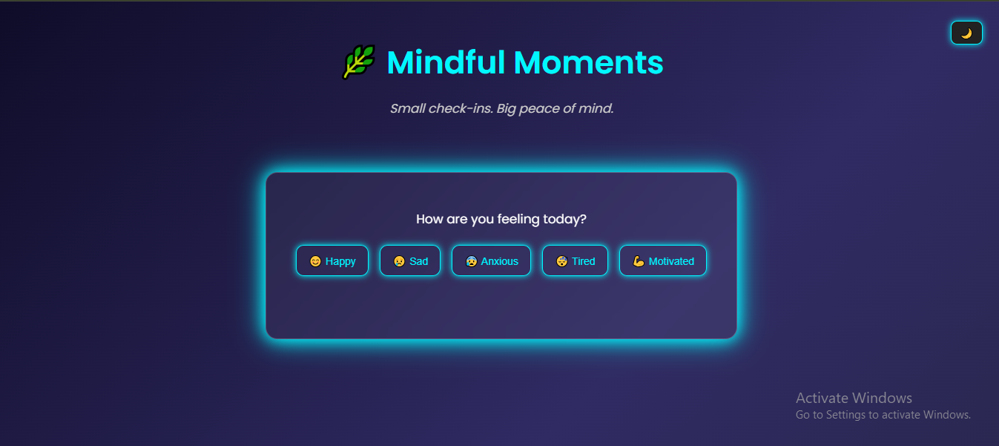
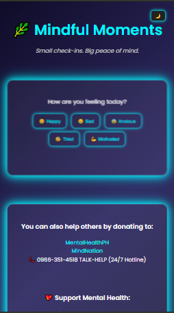

# 🌿 Mindful Moments

**Mindful Moments** is a simple, interactive web project that promotes mental health awareness. It helps users reflect on their emotions and provides supportive messages based on how they’re feeling. The site also encourages donations to trusted Philippine mental health organizations.

## 💡 Why I Built This

This is my first hackathon project. I wanted to build something meaningful, accessible, and positive — a place where people can take a moment for themselves and be reminded they're not alone. Mental health matters, and this is my small contribution to spreading that message.

## 🚀 Features

- 🌗 **Light/Dark mode toggle** with local storage memory
- 😊 Mood check-in: Interactive mood buttons
- 💬 Instant mental wellness messages
- 🤝 Donation resources to real mental health orgs in the Philippines
- ✨ Smooth animations using AOS (Animate On Scroll)
- 💙 Responsive and clean glassmorphism UI

## 🛠️ Tech Stack

- HTML5
- CSS3
- JavaScript (Vanilla)
- [AOS.js](https://michalsnik.github.io/aos/) for scroll animations
- [Google Fonts](https://fonts.google.com/) - Poppins

## 🧪 How to Run

1. Clone or download the repository
2. Open `homepage.html` in your browser
3. That’s it! No build tools or installations needed.

## 📸 Screenshots

### Desktop View

### Mobile View

## 📬 Contact

**Developed by:** Jhon Paul Baonil  
Email: your-email@example.com (optional)  
GitHub: [yourusername](https://github.com/yourusername)

---

*This project was submitted as part of my first hackathon.*  
